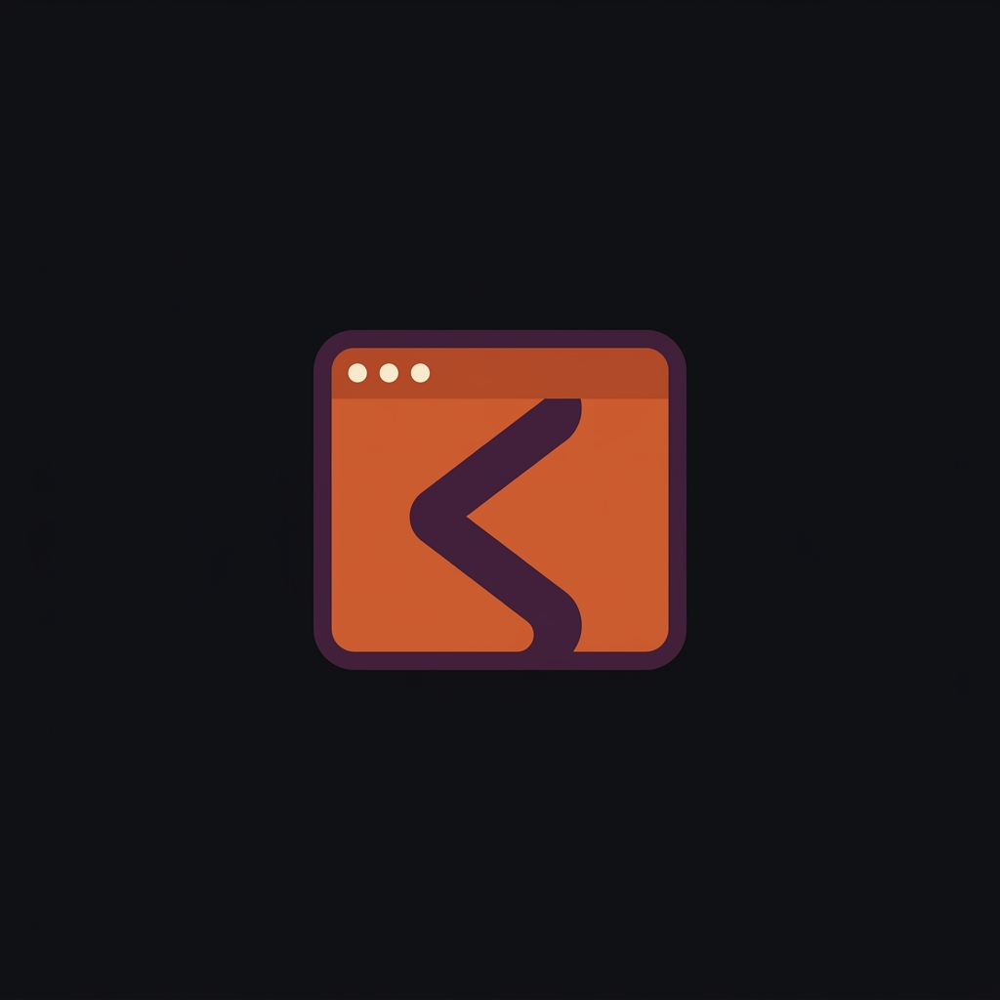

<div align="center">



# LLM-as-DOM

## Your AI agent's browser

**Test your app 60x cheaper. lad compresses your DOM so Claude never parses HTML.**

[](https://github.com/example-org/llm-as-dom/actions/workflows/ci.yml)
[](https://docs.rs/example-org-mcp-lad)

[](https://crates.io/crates/example-org-mcp-lad)
[](https://www.npmjs.com/package/@example-org/mcp-lad)
[](https://pypi.org/project/example-org-mcp-lad/)

[](https://www.rust-lang.org)
[](LICENSE)
[](https://modelcontextprotocol.io)

[Quick Start](#quick-start) · [How It Works](#how-it-works) · [Multi-Engine](#multi-engine) · [MCP Server](#mcp-server) · [Watch System](#watch-system) · [Playwright Parity](#playwright-parity) · [Benchmarks](#benchmarks)

</div>

---

## The Problem

Your AI agent wastes **80% of tokens** reading raw HTML. A login test costs ~15,000 tokens across 4 Playwright roundtrips — and most of that is parsing DOM, not thinking.

## The Solution

`lad` compresses your page to **~100-300 tokens** and navigates using heuristics. No LLM needed for login, search, or form fill. Your orchestrator (Claude, GPT) gets structured results, never HTML.

```
Traditional:  Claude → Playwright → 15KB HTML → Claude parses → click → repeat (×4)
lad:          Claude → lad_browse("test login") → { success: true, steps: 3 }
```

## Quick Start

```bash
cargo install example-org-mcp-lad

# See what lad "sees" on your app
lad --url "http://localhost:3000/login" --extract-only

# Test a login flow (heuristics only, no LLM needed)
lad --url "http://localhost:3000/login" \
    --goal "login as test@example.com with password secret123"

# Watch it work (opens browser window)
lad --url "http://localhost:3000/login" \
    --goal "login as test@example.com with password secret123" \
    --visible
```

### Two Modes

| Mode | Flag | Use case |
|------|------|----------|
| **Headless** | (default) | CI/CD pipelines, automated testing |
| **Visible** | `--visible` | Debugging, watching what the pilot does |

## How It Works

```
Your App (localhost)          lad                         Claude
     │                          │                           │
     │◄── navigate ─────────────┤                           │
     ├── DOM ──────────────────►│                           │
     │                          ├─ compress (85x)           │
     │                          ├─ heuristics (310ns) ──┐   │
     │                          │   no LLM needed!      │   │
     │◄── type/click ───────────┤◄──────────────────────┘   │
     │                          │   ... repeat ...          │
     │                          ├── {success, steps} ──────►│
     │                          │   (~300 tokens)           │
```

### Five Decision Tiers

| Tier | Strategy | Speed | Cost | When |
|------|----------|-------|------|------|
| **0** | Playbook replay | **instant** | **Free** | Trained flows (login, checkout) |
| **1** | @lad/hints | **instant** | **Free** | `data-lad` developer annotations |
| **2** | Heuristics | **310ns** | **Free** | Login, search, form fill — 90% of actions |
| **3** | Cheap LLM | 0.4s | Free (Ollama) | Ambiguous elements, unknown pages |
| **4** | Escalate | — | — | Screenshot sent to orchestrator |

Most dev testing **never hits the LLM**. Heuristics parse your goal, match form fields by name/type/label, find submit buttons, and detect success — all in nanoseconds.

## Multi-Engine

lad is **browser-agnostic**. The pilot, heuristics, and LLM reasoning never touch browser APIs directly — they operate on a compressed `SemanticView`. The actual browser is a pluggable adapter.

### Supported Engines

| Engine | Flag | Runtime | Platforms |
|--------|------|---------|-----------|
| **Chromium** | `--engine chromium` (default) | Chrome/Chromium install | Linux, macOS, Windows |
| **WebKit** | `--engine webkit` | Native WKWebView | macOS (zero install) |

```bash
# Chromium (default)
lad --url "https://example.com" --extract-only

# WebKit (macOS — no Chrome needed)
lad --url "https://example.com" --engine webkit --extract-only
```

### Why Multi-Engine Matters

1. **Real rendering differences** — Safari handles flexbox, `<dialog>`, scroll, clipboard API differently. Testing only in Chromium misses ~20% of the web.
2. **Zero install on macOS** — WebKit comes with the OS. No 500MB Chrome download.
3. **System proxy** — WKWebView respects macOS proxy/VPN settings automatically.
4. **Your protocol** — the WebKit adapter uses a simple stdin/stdout JSON protocol. Adding new engines (Firefox, Electron) means writing a ~300 line bridge app.

### Architecture

```
┌────────────────────────────────────────────────┐
│                 lad (Rust)                     │
│                                                │
│  SemanticView ← a11y.rs (JS injection)        │
│       │                                        │
│  pilot.rs → heuristics → LLM → action         │
│       │                                        │
│  BrowserEngine trait ── PageHandle trait        │
│       │                        │               │
│  ┌────┴────┐            ┌─────┴─────┐         │
│  │Chromium │            │  WebKit   │         │
│  │Adapter  │            │  Adapter  │         │
│  └────┬────┘            └─────┬─────┘         │
└───────┼───────────────────────┼────────────────┘
        │ CDP (WebSocket)       │ stdin/stdout JSON
        ▼                       ▼
   ┌─────────┐          ┌──────────────┐
   │ Chrome  │          │ Swift macOS  │
   │ process │          │ WKWebView    │
   └─────────┘          └──────────────┘
```

The `PageHandle` trait has 9 methods. That's the entire browser API surface:

```rust
#[async_trait]
pub trait PageHandle: Send + Sync {
    async fn eval_js(&self, script: &str) -> Result<Value>;
    async fn navigate(&self, url: &str) -> Result<()>;
    async fn wait_for_navigation(&self) -> Result<()>;
    async fn url(&self) -> Result<String>;
    async fn title(&self) -> Result<String>;
    async fn screenshot_png(&self) -> Result<Vec<u8>>;
    async fn cookies(&self) -> Result<Vec<CookieEntry>>;
    async fn set_cookies(&self, cookies: &[CookieEntry]) -> Result<()>;
    async fn enable_network_monitoring(&self) -> Result<bool>;
}
```

Everything in `a11y.rs` (DOM extraction), `pilot.rs` (decision loop), and all 11 heuristic modules operates on `SemanticView` — they have no idea which engine is running.

## Use Cases

### Local Development
```bash
# Test your login
lad --url "http://localhost:3000/account/login" \
    --goal "login as test@shop.com with password test123"

# Test search
lad --url "http://localhost:3000" \
    --goal "search for 'blue t-shirt'"

# Test checkout flow
lad --url "http://localhost:3000/cart" \
    --goal "fill shipping with name=John email=john@test.com"

# Extract product catalog structure
lad --url "http://localhost:3000/collections/all" --extract-only
```

### CI/CD Pipeline
```yaml
# GitHub Actions
- name: Smoke test login
  run: lad --url "http://localhost:3000/login" --goal "login as ci@test.com with password ci_pass" --max-steps 5
```

### Cross-Engine Testing
```bash
# Same test, both engines — catch rendering differences
lad --url "https://myapp.com/login" --engine chromium --extract-only > chromium.json
lad --url "https://myapp.com/login" --engine webkit   --extract-only > webkit.json
diff chromium.json webkit.json
```

### Staging E2E
```bash
lad --url "https://staging.myapp.com/login" \
    --goal "login as qa@test.com with password staging123" \
    --backend zai --model glm-4.7  # cloud LLM for complex pages
```

## MCP Server

`llm-as-dom-mcp` turns your browser into a tool that Claude can call directly. **21 semantic tools** — full Playwright parity with 60x fewer tokens.

```bash
llm-as-dom-mcp  # starts MCP server (stdio)
```

### Autonomous

| Tool | What it does |
|------|-------------|
| `lad_browse` | Navigate to a URL and accomplish a goal autonomously (login, fill form, click, search) |

### Extraction

| Tool | What it does |
|------|-------------|
| `lad_extract` | Extract structured page info: elements, text, page type. Never returns raw HTML |
| `lad_snapshot` | Semantic snapshot of the current page — elements with IDs for `lad_click`/`lad_type`. Like Playwright's `browser_snapshot` but 10-60x fewer tokens |
| `lad_screenshot` | Take a base64-encoded PNG screenshot of the active page |

### Interaction

| Tool | What it does |
|------|-------------|
| `lad_click` | Click an element by its ID from `lad_snapshot` |
| `lad_type` | Type text into an element by its ID from `lad_snapshot` |
| `lad_select` | Select a dropdown option by element ID from `lad_snapshot` |
| `lad_press_key` | Press a keyboard key (Enter, Tab, Escape, etc.). Optionally focus an element first |
| `lad_hover` | Hover over an element — triggers dropdown menus, tooltips, hover states |
| `lad_upload` | Upload file(s) to a `<input type="file">` element (Chromium CDP) |

### Dialog Handling

| Tool | What it does |
|------|-------------|
| `lad_dialog` | Handle JavaScript dialogs (alert/confirm/prompt) — accept, dismiss, or inspect history |

### Waiting

| Tool | What it does |
|------|-------------|
| `lad_wait` | Wait for a semantic condition to be true (blocks until satisfied or timeout) |
| `lad_watch` | Continuous page monitoring — start/stop polling, diff semantic views, cursor-based event retrieval |

### Verification

| Tool | What it does |
|------|-------------|
| `lad_assert` | Check assertions on a URL: has login form, title contains X, has button Y |
| `lad_audit` | Audit page quality: a11y (alt text, labels), forms (autocomplete), links (void hrefs) |

### Navigation

| Tool | What it does |
|------|-------------|
| `lad_back` | Navigate back in browser history |

### Debugging

| Tool | What it does |
|------|-------------|
| `lad_eval` | Evaluate arbitrary JavaScript — escape hatch for when semantic tools can't handle a specific interaction |
| `lad_network` | Inspect network traffic with timing data. Filter by type: auth, api, navigation, asset |
| `lad_locate` | Map a DOM element back to its source file (React dev source, data-ds, data-lad attributes) |

### Lifecycle

| Tool | What it does |
|------|-------------|
| `lad_close` | Close the browser and release all resources |
| `lad_session` | View or reset session state: auth status, visited URLs, browse count |

<details>
<summary>Claude Desktop config</summary>

```json
{
  "mcpServers": {
    "lad": {
      "command": "llm-as-dom-mcp",
      "env": {
        "LAD_LLM_URL": "http://localhost:11434",
        "LAD_LLM_MODEL": "qwen2.5:7b",
        "LAD_ENGINE": "chromium"
      }
    }
  }
}
```

Set `LAD_ENGINE=webkit` for WebKit on macOS.
</details>

## Watch System

`lad_watch` enables continuous page monitoring — your agent can observe a page over time and react to changes without polling manually.

```
Agent                          lad_watch                         Page
  │                                │                               │
  ├─ start(url, interval_ms) ─────►│  begin polling loop           │
  │                                ├── extract SemanticView ◄──────┤
  │                                ├── diff against previous       │
  │                                ├── store in ring buffer (cap 1000)
  │                                ├── MCP resource notification ──►│ (push to client)
  │                                │   ... repeat every tick ...   │
  │                                │                               │
  ├─ events(since_seq=42) ────────►│  cursor-based retrieval       │
  │◄──── [events 43..N] ──────────┤                               │
  │                                │                               │
  ├─ stop ────────────────────────►│  cleanly abort                │
```

- **Ring buffer** stores up to 1,000 events with monotonic sequence numbers
- **Semantic diffing** via `observer.rs` — detects added/removed/changed elements, value changes, disabled state transitions
- **MCP resource notifications** pushed to client on each non-empty diff (`watch://url`)
- **Cursor-based retrieval** — `since_seq=N` returns only events newer than sequence N

## Playwright Parity

lad matches Playwright's tool surface with fundamentally different economics:

| Dimension | lad | Playwright MCP |
|-----------|-----|---------------|
| **Tools** | 21 | 21 |
| **Tokens per login test** | ~300 | ~18,000 |
| **Cost ratio** | 1x | 60x |
| **Decision engine** | Heuristics-first (70-90% no LLM) | None — LLM parses every page |
| **Output format** | Semantic JSON (never raw HTML) | Raw DOM snapshots |
| **Browser engines** | Chromium + WebKit | Chromium only |
| **DOM traversal** | Shadow DOM + same-origin iframes | Standard DOM |

The key architectural difference: Playwright gives the LLM a DOM and asks it to figure out what to do. lad compresses the DOM, runs heuristics, and only calls the LLM when genuinely ambiguous.

## Benchmarks

### Token Savings

| Approach | Tokens per login test | Cost (Opus) |
|----------|----------------------|-------------|
| Playwright MCP (4 roundtrips) | ~18,000 | ~$0.36 |
| **lad** (1 call, heuristics) | **~300** | **$0.006** |
| **Savings** | **60x fewer** | **60x cheaper** |

### DOM Compression

| Page | Raw DOM | lad tokens | Compression |
|------|---------|-----------|-------------|
| Login form | ~8,000 | **91** | 88x |
| GitHub login | ~25,000 | **343** | 73x |
| Complex SPA | ~40,000 | **606** | 66x |

### Decision Speed

| Engine | Latency | Cost |
|--------|---------|------|
| Heuristics | **310ns** | Free |
| qwen2.5-7b (Ollama) | 0.4s | Free |
| glm-4.7 (Z.AI cloud) | 1.7s | ~$0.001 |

### Cross-Engine Parity

Same page, same extraction — both engines produce identical `SemanticView`:

| Metric | Chromium | WebKit |
|--------|----------|--------|
| GitHub login elements | 9 | 12 (+ cookie banner) |
| Page hint | "login page" | "login page" |
| Core form fields | username, password, submit | username, password, submit |
| HN front page elements | 50/163 | 50/163 |

The 3 extra WebKit elements are footer links that GitHub serves differently to Safari — exactly the kind of difference multi-engine testing catches.

## Test Suite

- **387 tests** (unit + chaos + integration + protocol)
- **11 heuristic modules** (login, form, search, navigation, OAuth, MFA, ecommerce, validation, multistep, hints, selector)
- **8 micro-benchmarks** (criterion)
- **~13,600 lines of Rust** (45 files) + ~576 lines of Swift

## Requirements

- **Chromium engine**: Chrome/Chromium (system install)
- **WebKit engine**: macOS 12+ (nothing to install — WebKit is built-in)
- **LLM fallback** (optional): Ollama with `qwen2.5:7b`

```bash
cargo install example-org-mcp-lad  # installs both lad and llm-as-dom-mcp
```

## Architecture

See [ARCHITECTURE.md](ARCHITECTURE.md) for the full technical deep-dive.

## License

AGPL-3.0-or-later — see [LICENSE](LICENSE).
